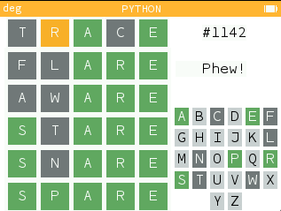

# Wordle clone for the NumWorks
Wordle clone for the NumWorks calculator in micropython.

This version can be run on a PC.

You can find the minified NumWorks version at [my repository](https://my.numworks.com/python/fizban/wordle).

You can play directly on your browser thanks to pyodide integration of pygame (it takes some time for the initial load):
[online NumWorks wordle](https://fizban99.github.io/numworks_wordle/app)

## Features
- Use directly the letters in the calculator, without pressing the alpha key. In the desktop version, you can use the letters of the keyboard.
- It contains a dictionary of 12971 words, out of which 2315 are candidates for a wordle. The dictionary is compressed as a trie and encoded in Base64 so that it fits in the 32K script limit.
- Each word has an id so that it can be used to compete with other users if they enter the same id.
